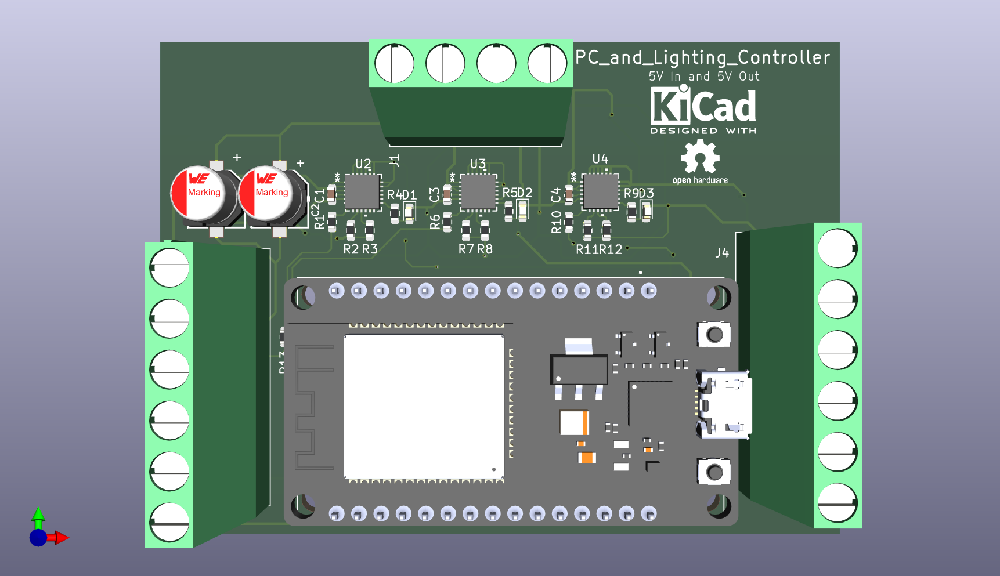

# PC & Light Controller

ESP32-based remote control system for PC power management and room lighting via Tailscale.



## Features

- **3x TPS259807ONRGER eFuse Switches**: DC load switching for IKEA LED lights (5V)
- **Motor Control**: Automated UPS power button actuation
- **Remote Access**: Tailscale integration for secure remote control via SSH
- **Custom PCB**: 4-layer board designed in KiCad
- **Power**: Powered by custom 60W dual-rail PSU (3.3V/5V @ 6A each)

## Hardware Specifications

### Main Components
- **MCU**: ESP32 WiFi Module
- **Load Switches**: 3x TPS259807ONRGER eFuse (adjustable current limit)
- **Motor Driver**: [TBD - specify motor driver IC]
- **Power Input**: 5V from 60W PSU
- **PCB**: 4-layer, [dimensions TBD]

### Pinout
```
ESP32 GPIO Assignments:
- GPIO X: LED Switch 1 (TPS259807 EN pin)
- GPIO X: LED Switch 2 (TPS259807 EN pin)
- GPIO X: LED Switch 3 (TPS259807 EN pin)
- GPIO X: Motor Control (PWM/Direction)
- GPIO X: Motor Control (PWM/Direction)
```

### Schematic
[Download PDF](hardware/exports/schematic.pdf)

## Firmware Architecture

### Technology Stack
- **Framework**: Arduino/ESP-IDF (PlatformIO)
- **Networking**: WiFi + Tailscale client on host network
- **Protocol**: Simple TCP socket server or HTTP API
- **Libraries**:
  - WiFi.h (ESP32 WiFi)
  - WebServer.h or AsyncTCP (command interface)

### Command Interface
The ESP32 runs a simple TCP server accessible via Tailscale IP. See [Command API](docs/commands/API.md) for full reference.

Quick examples:
```bash
# From phone terminal via Tailscale
ssh user@arch-pc "echo 'LED1_ON' | nc <esp32-tailscale-ip> 8888"
ssh user@arch-pc "echo 'LED2_OFF' | nc <esp32-tailscale-ip> 8888"
ssh user@arch-pc "echo 'MOTOR_PRESS' | nc <esp32-tailscale-ip> 8888"
```

## Getting Started

### Hardware Assembly
See [ASSEMBLY.md](docs/ASSEMBLY.md) for detailed build instructions.

### Firmware Setup

1. **Install PlatformIO**:
```bash
# Via package manager or VSCode extension
yay -S platformio-core
```

2. **Configure WiFi credentials**:
```bash
cp firmware/include/config.h.example firmware/include/config.h
# Edit config.h with your WiFi SSID/password
```

3. **Upload firmware**:
```bash
cd firmware
pio run --target upload
```

4. **Get ESP32 IP**:
```bash
pio device monitor
# Note the IP address printed on boot
```

5. **Add to Tailscale network**:
   - Ensure ESP32 is on same LAN as Tailscale subnet router
   - Access via your Arch PC's Tailscale connection

## PCB Manufacturing

### Gerber Files
Gerbers for manufacturing are in [hardware/exports/gerbers/](hardware/exports/gerbers/)

### BOM
See [hardware/bom/bom.csv](hardware/bom/bom.csv) for complete parts list.

### Recommended Manufacturers
- JLCPCB (4-layer, ENIG finish recommended)
- PCBWay

## Usage

### Basic Commands

#### LED Control
```bash
# Turn on LED strip 1
echo 'LED1_ON' | nc <esp32-ip> 8888

# Turn off LED strip 2
echo 'LED2_OFF' | nc <esp32-ip> 8888

# Toggle LED strip 3
echo 'LED3_TOGGLE' | nc <esp32-ip> 8888
```

#### UPS Control
```bash
# Actuate UPS power button
echo 'MOTOR_PRESS' | nc <esp32-ip> 8888
```

### Remote Control via Phone
Since you use Tailscale to control your Arch system, you can proxy commands:
```bash
# SSH into Arch PC from phone
ssh carl@m-arch

# Then send commands to ESP32
echo 'LED1_ON' | nc 192.168.x.x 8888
```

Or create shell scripts on your Arch PC for one-command execution:
```bash
# ~/bin/lights-on
#!/bin/bash
echo 'LED1_ON' | nc 192.168.x.x 8888
echo 'LED2_ON' | nc 192.168.x.x 8888
echo 'LED3_ON' | nc 192.168.x.x 8888
```

Then from phone:
```bash
ssh carl@m-arch ~/bin/lights-on
```

## Development Workflow

### KiCad → Gerbers
```bash
cd hardware/kicad
# Design in KiCad
# File → Plot → Generate Gerbers
# Move to hardware/exports/gerbers/
```

### Code → Flash
```bash
cd firmware
pio run --target upload
pio device monitor  # View serial output
```

### Update Documentation
```bash
# Take photos of assembled board
# Place in docs/images/
# Update README.md
git add .
git commit -m "docs: add assembly photos"
git push
```

## Project Status

- [ ] Schematic design
- [ ] PCB layout
- [ ] Order PCBs
- [ ] Firmware scaffold
- [ ] Motor control implementation
- [ ] Switch control implementation
- [ ] Network interface
- [ ] Assembly
- [ ] Testing
- [ ] Documentation

## Photos

### Board Assembly


### In Action


## License

Hardware: [CERN-OHL-P v2](LICENSE)

Firmware: MIT License (to be added)

## Contributing

This is a personal project, but feel free to open issues or submit PRs if you find bugs or have suggestions.

## Author

**Mak** - [HighCarlSagan](https://github.com/HighCarlSagan)

Part of my home automation & hardware design projects. Check out my other repos:
- [Universal 60W PSU](https://github.com/HighCarlSagan/60w-dual-rail-psu)
- [Satellite Power Sizing Tool](...)

---

**Note**: This board interfaces with mains-powered equipment (UPS). Ensure proper isolation and safety measures during installation.
