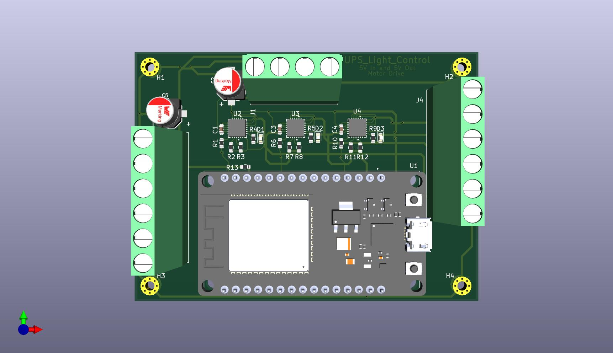
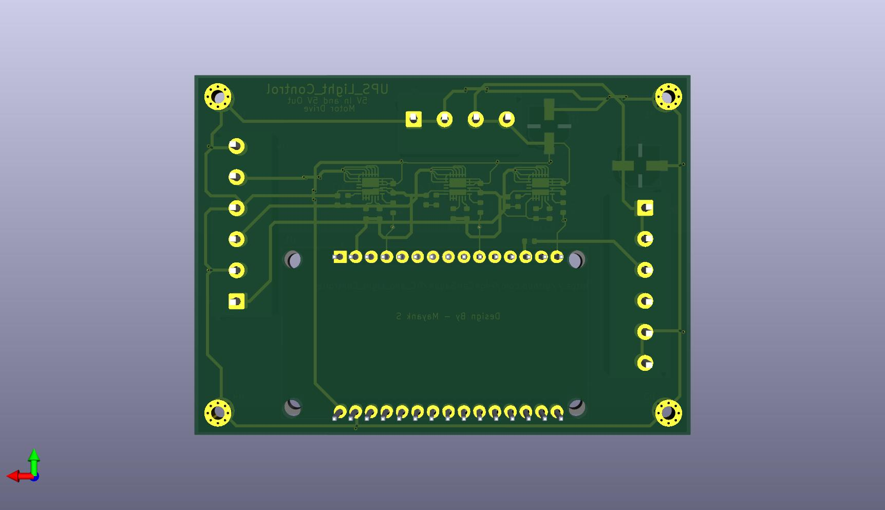

# PC & Light Controller


A single-board ESP32 controller that remotely actuates a PC's UPS power button via servo and switches three 5 V LED lighting channels via eFuses — all driven from a Telegram bot. Part of a larger homelab automation setup.

<p align="center">
  
  
</p>

---

## Why I Built This

I needed a physical "finger" to press the UPS power button on my desk so I could wake the PC from anywhere — usually while travelling, sometimes just from another room — without opening the UPS chassis (which would void warranty) and without buying a generic smart-plug solution that wouldn't fit cleanly into the rest of my homelab.

This board is the missing piece in a longer chain: once the UPS is on, my homelab handles the rest — Wake-on-LAN brings up the PC, Tailscale + SSH let me into the machine, and Home Assistant takes care of the rest of the room. The UPS button was the one stubbornly physical step left, and the LEDs were a natural extension once I had an ESP32 sitting there with spare GPIOs and a free 5 V rail.

A few things I deliberately wanted out of the project:

- **Telegram bot integration without port forwarding** — the ESP32 polls outbound, no inbound ports exposed
- **No new cloud dependency beyond Telegram** — everything else stays local to the homelab
- **Clean integration with my existing 5 V/3.3 V bench supply** — no extra wall-warts
- **A learning project for ESP32 + eFuse load switching** — TPS259807 with proper ILIM configuration

---

## Initial Requirements

| # | Requirement | Target | Outcome |
|---|---|---|---|
| 1 | UPS power-button actuation | Non-invasive, preserves warranty | Servo-actuated push (no electrical mod to UPS) |
| 2 | LED channels | 3 independently switched 5 V loads | 3× TPS259807 eFuse channels |
| 3 | Per-channel current | ≥ 0.5 A per channel | ILIM set to 1 A per channel (headroom) |
| 4 | Remote control | Internet-reachable, no port forwarding | Outbound Telegram bot polling |
| 5 | Security | Only authorized user can issue commands | Chat ID allowlist verification |
| 6 | Homelab integration | Works alongside WoL + SSH workflow | Sits as the "physical actuator" tier |
| 7 | Power | Powered from existing dual-rail bench PSU | Single 5 V input |
| 8 | MCU count | Single board, single MCU | One ESP32 DevKit V1 doing both jobs |
| 9 | Variable per-channel current limit | Set in firmware/UI | **V1 has fixed 1 A** — V2 will use software-trim ILIM |
| 10 | Local fallback (LAN-only mode) | Optional | Not in V1 — Telegram-only for now |

---

## Specifications

| Parameter | Value |
|---|---|
| MCU | ESP32 DevKit V1 (ESP-WROOM-32) |
| Input voltage | 5 V DC |
| Light channels | 3× TPS259807 eFuse, ILIM = 1 A each |
| Servo output | 1× PWM (5 V tolerant) |
| Status indicators | 3× per-channel LEDs |
| PCB | 2-layer FR-4, 1.6 mm |
| Connectors | 1× 4-pin power input, 2× 6-pin output blocks |
| Mounting | 4× corner holes |
| Communication | WiFi 802.11 b/g/n + outbound HTTPS to Telegram |

---

## Architecture

```
                                   ┌──────────────────┐
   Telegram Cloud  ◀──HTTPS poll──▶│   ESP32 DevKit   │
                                   │   (single MCU)   │
                                   └──┬─────┬─────┬───┘
                                      │     │     │
            GPIO ──────┬───────┬──────┘     │     │
                       │       │            │     │
                  ┌────▼─┐ ┌───▼──┐ ┌───────▼──┐  │
                  │ EN1  │ │ EN2  │ │   EN3    │  │  PWM
                  │TPS1  │ │TPS2  │ │   TPS3   │  │   │
                  │259807│ │259807│ │  259807  │  │   ▼
                  └──┬───┘ └──┬───┘ └────┬─────┘  │  Servo
                     │        │          │        │   │
                  Light 1  Light 2    Light 3     │   ▼
                                                  │  UPS button
                                                  └─ (mechanical press)
```

A single ESP32 polls the Telegram bot every ~1 second, parses incoming commands, and dispatches to either:

- **GPIO outputs** driving the EN pins of three TPS259807 eFuses (light channels), or
- **A PWM channel** driving a servo whose horn physically presses the UPS power button.

Per-channel status LEDs reflect the current state of each light. A chat-ID allowlist in firmware ensures only authorized users can issue commands.

---

## Why a Servo for the UPS Button?

This is the unusual design choice and worth calling out: most projects that automate a button-press would either tap directly across the button contacts with a transistor, or use a relay. Both work — neither was acceptable here.

The UPS is still under warranty. Opening it to solder anything across the button contacts would void that. A servo with a 3D-printed horn pressing the button externally is fully non-invasive — the UPS sees nothing electrically unusual, the warranty stays intact, and the same approach generalizes to any push-button I might want to actuate later (microwave, doorbell, whatever). It's a slightly larger mechanical solution, but mechanically and electrically clean.

---

## Key Components

| Reference | Part | Function |
|---|---|---|
| U1 | ESP32 DevKit V1 | WiFi + dual-core MCU, both controllers in one |
| U2, U3, U4 | TI TPS259807ONRGER | 5 V eFuse load switches with adjustable current limit |
| D1, D2, D3 | LEDs (0603) | Per-channel status indicators |
| C2, C5 | 100 µF / 16 V | Bulk decoupling on input + output |
| C1, C3, C4 | 0.1 µF / 16 V | Local decoupling at each TPS259807 |
| R1/R6/R10 | 220 Ω | LED current limiting |
| R2/R7/R11 | 298 Ω | TPS259807 ILIM resistor (sets ~1 A current limit) |
| R3/R8/R12 | 10 kΩ | TPS259807 EN pull-down |
| R4/R5/R9/R13 | 1 kΩ | GPIO series resistors / servo signal |
| J1 | 4-pin screw terminal | 5 V power input from external PSU |
| J3, J4 | 6-pin screw terminals | Light output channels + servo header |

---

## Connector Pinout

| Connector | Function |
|---|---|
| J1 | 5 V input from external PSU (V+, V+, GND, GND) |
| J3 | Light outputs (channels 1–3) — V+ and GND pairs per channel |
| J4 | Servo header + auxiliary outputs |

> Detailed pin-by-pin assignments are on the PCB silkscreen and in `hardware/Exports/schematic.pdf`.

---

## Firmware

### Architecture

Single firmware image runs on one ESP32 and serves both the UPS-press and lights-switching commands. Internally the code is split into two logical modules under separate folders so the unit-tests stay focused, but only one binary gets flashed.

| Layer | Library / Framework |
|---|---|
| Build system | PlatformIO |
| Framework | Arduino-ESP32 |
| Networking | WiFi.h + WiFiClientSecure |
| Telegram client | UniversalTelegramBot |
| Servo control | ESP32Servo |
| JSON parsing | ArduinoJson |

### Command interface

Commands are split by prefix so both function groups remain logically separate:

**UPS commands** (servo actuation):
- `/ups_press` — Press the UPS power button
- `/ups_status` — Get controller status
- `/ups_help` — Show help

**Lights commands**:
- `/lights_<n>_on`, `/lights_<n>_off` — Control individual light (n = 1, 2, 3)
- `/lights_all_on`, `/lights_all_off` — Bulk control
- `/lights_status` — Report current state of all channels
- `/lights_help` — Show help

Full command reference: [`docs/commands/TELEGRAM_COMMANDS.md`](docs/commands/TELEGRAM_COMMANDS.md)

### Security

- **Chat ID allowlist** — only pre-registered Telegram chat IDs are honored, all others ignored
- **Outbound-only networking** — no inbound ports, no port forwarding, no exposed services on the LAN
- **TLS to Telegram** — all command traffic over HTTPS
- **Secrets isolation** — WiFi credentials, bot token, and chat IDs live in `secrets.h`, gitignored, with an `.example` template committed

### Repository layout for firmware

```
firmware/
├── ups-controller/                 # UPS servo logic (build target 1)
│   ├── include/
│   │   ├── config.h                # Pin assignments, timing constants
│   │   ├── secrets.h               # GITIGNORED — actual credentials
│   │   └── secrets.h.example       # Template
│   ├── src/main.cpp
│   └── platformio.ini
└── lights-controller/              # LED switching logic (build target 2)
    ├── include/                    # Same structure as above
    ├── src/main.cpp
    └── platformio.ini
```

> The two folders compile to two separate firmware images in the V1 development setup. For deployment, both feature sets will be merged into a single combined firmware image for the production ESP32 — that consolidation is part of the deployment step.

---

## Setup & Deployment

> **Status:** PCB delivered, awaiting assembly. Step-by-step setup will be added here once the board is soldered, flashed, and deployed in the rack.

This section will cover:

1. Bill of materials acquisition
2. SMD + through-hole assembly notes
3. ESP32 first-flash procedure
4. Telegram bot creation (BotFather workflow)
5. Configuring `secrets.h` (WiFi, bot token, chat ID allowlist)
6. Initial bringup test sequence (status LED check, channel-by-channel test, servo calibration)
7. Mounting and mechanical alignment of the servo to the UPS button
8. Integration into the homelab rack and final cabling

---

## Testing

> Test results will be added in `docs/images/` and a summary table here once bringup is complete.

### Planned bringup test sequence

| Step | Test | Pass criteria |
|---|---|---|
| 1 | Visual inspection | No solder bridges, all parts present, polarized parts oriented correctly |
| 2 | Power-on, no firmware | 5 V rail clean, no smoke, current draw < 50 mA at idle |
| 3 | Firmware flash | ESP32 enumerates, serial console prints boot banner |
| 4 | WiFi association | Connects to configured SSID, IP assigned |
| 5 | Telegram heartbeat | Bot responds to `/lights_help` and `/ups_help` |
| 6 | Light channel test (no load) | Each EN GPIO toggles its eFuse; status LED follows; no output current with no load attached |
| 7 | Light channel test (with load) | Each channel drives an LED strip up to ~0.5 A; status LED on; eFuse cool |
| 8 | Light channel overcurrent test | Force ~1.2 A on one channel, eFuse trips, channel recovers after re-enable |
| 9 | Servo sweep | Manual `/ups_press` triggers full press-and-release cycle, audible click on UPS |
| 10 | Soak test | All three lights on + occasional servo press, 1 hour, no thermal issues |

### Results

*To be filled in after bringup.*

---

## Hardware

### PCB

- 2-layer FR-4
- 1.6 mm thickness
- 1 oz copper
- ENIG or HASL lead-free
- Designed in KiCad 9.0
- Compatible with JLCPCB, PCBWay, OSHPark, etc.

### Manufacturing files

- Gerbers + drill files: [`hardware/Exports/Gerbers/`](hardware/Exports/Gerbers/)
- Zipped gerbers (drag-and-drop into fab portals): `hardware/Exports/pc_and_light_controller_gerbers.zip`
- Interactive BOM: `hardware/Exports/ibom.html`
- BOM CSV: `hardware/Exports/UPS_Switch_BoM.csv`
- Schematic PDF: `hardware/Exports/schematic.pdf`

---

## Repository Structure

```
PC_and_Light_Controller/
├── docs/
│   ├── commands/
│   │   └── TELEGRAM_COMMANDS.md         # Full command reference
│   ├── Flashing_Guide_Mini.md           # ESP32 flash quick reference
│   ├── images/                          # Photos & screenshots
│   └── pinout.ini                       # Pin assignment reference
├── firmware/
│   ├── ups-controller/                  # Servo / UPS button firmware module
│   └── lights-controller/               # Lights / eFuse firmware module
├── hardware/
│   ├── Exports/                         # Gerbers, BOM, renders, schematic
│   ├── Libraries/                       # Custom KiCad symbols, footprints, 3D models
│   ├── PC_and_Light_Controller.kicad_pro
│   ├── PC_and_Light_Controller.kicad_sch
│   └── PC_and_Light_Controller.kicad_pcb
├── enclosure/
│   └── docs/                            # FreeCAD / Blender enclosure work
├── LICENSE
└── README.md
```

---

## When to Use This

**Good fit:**
- Remote-pressing a physical button you can't or won't open
- Switching small 5 V DC loads (LED strips, fans, low-power lighting) with overcurrent protection
- Building blocks for a homelab automation tier where outbound-only networking is desired
- A learning vehicle for ESP32 + Telegram + eFuse load switching

**Not a good fit:**
- Mains-voltage switching (use a proper relay board with isolation)
- High-current loads above ~1 A per channel (the V1 ILIM cap)
- Time-critical control where ~1 second polling latency matters
- Air-gapped networks (V1 is Telegram-dependent — V2 will add a local-only path)

---

## Roadmap

### V1 (current)
- ✅ Hardware design complete
- ✅ Firmware logic written and tested on dev boards
- 🔄 PCB assembly pending
- 🔄 First-deployment bringup pending

### V2 wishlist
- Variable per-channel current limit (digitally trimmable ILIM)
- Local-only control path (MQTT to homelab broker, Telegram becomes one of multiple frontends)
- Per-channel current measurement (INA-class shunt monitor) for telemetry back to homelab
- Combined unified firmware image instead of two-folder dev split
- Onboard 5 V regulation so the board can be powered from a wider input range
- Status display (small OLED) showing channel state and last command

---

## Security Note

This board exists inside a private homelab network and is gated by a Telegram chat-ID allowlist. As deployed:

- Network-side identifiers (SSID, IPs, MACs) are intentionally **not** committed to this repo
- All credentials live in `secrets.h` files which are gitignored — only `.example` templates ship
- The Telegram bot token is the principal credential; treat it like a password

If you fork this and deploy it on your own network, replace every value in `secrets.h.example` with your own and never commit a real `secrets.h`.

---

## License

- **Hardware**: [CERN-OHL-P-2.0](LICENSE) (Permissive)
- **Firmware**: MIT

---

## Related Projects

- [Dual_Power_Supply](https://github.com/HighCarlSagan/Dual_Power_Supply) — provides the 5 V rail that powers this board
- [Carls_Homelab](https://github.com/HighCarlSagan/Carls_Homelab) — the rest of the homelab stack this integrates with

---

## Author

**Mayank S (HighCarlSagan)** — [GitHub @HighCarlSagan](https://github.com/HighCarlSagan) · [highcarlsagan.dev](https://highcarlsagan.dev)

